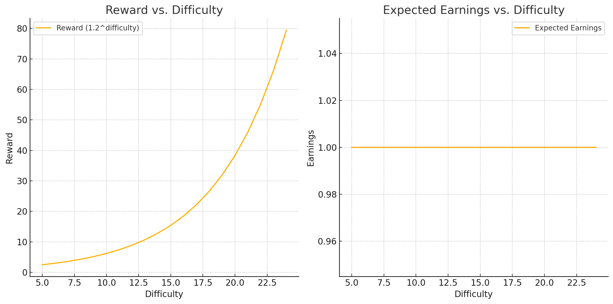

---

JellyFish is a layer 1 blockchain bringing a paradigm shift to Web3 through better technology and user experience. Built with Move to create a home for developers building next-gen applications.

### Miner Earnings
Over a sufficiently long time, the miner’s earnings will be the same regardless of difficulty, because:

- The protocol adjusts difficulty dynamically to ensure a fixed target time of one block per minute.
- Higher difficulty results in fewer rewarded hashes but larger rewards per hash.
- Lower difficulty results in more rewarded hashes but smaller rewards per hash.

#### Mathematical Explanation:
The miner’s earnings over time are proportional to:

**Earnings**: $P(\text{difficulty}) \cdot 1.2^{\text{difficulty}}$

Where:
- $P(\text{difficulty})$ is the probability of finding a valid hash at a given difficulty.
- $1.2^{\text{difficulty}}$ represents the reward for achieving that difficulty.

The dynamic adjustment ensures that $P(\text{difficulty})$ balances $1.2^{\text{difficulty}}$, leading to the same average earnings over time.

---

### Visual Representation

Below are two charts:
1. **Reward vs. Difficulty:** Illustrates how rewards grow exponentially with difficulty.
2. **Expected Earnings vs. Difficulty:** Shows how expected earnings remain constant over time due to the balancing effect of difficulty adjustment.

- **Reward vs. Difficulty:** As difficulty increases, the reward for a valid hash grows exponentially ($1.2^{\text{difficulty}}$).
- **Expected Earnings vs. Difficulty:** Despite the increase in reward with difficulty, the expected earnings remain constant due to the decreasing probability of finding a valid hash.

---

### Conclusion
The dynamic difficulty adjustment ensures miners earn the same over a sufficiently long time, regardless of the difficulty level.

## Getting Started

* [JellyFish Foundation](https://peerlync.com/)
* [JellyFish Developer Network](https://dev.peerlync.com)
* [Guide - Integrate with the Aptos Blockchain](https://dev.peerlync.com/guides/system-integrators-guide)
* [Tutorials](https://dev.peerlync.com/tutorials)
* Follow us on [Twitter](https://twitter.com/jellyfish).
* Join us on the [Aptos Discord](https://discord.gg/jellyfish).

## Contributing

You can learn more about contributing to the JellyFish project by reading our [Contribution Guide](https://github.com/winterbank/jellyfish/blob/main/CONTRIBUTING.md) and by viewing our [Code of Conduct](https://github.com/winterbank/jellyfish/blob/main/CODE_OF_CONDUCT.md).

JellyFish is licensed under [Apache 2.0](https://github.com/winterbank/jellyfish/blob/main/LICENSE).
